## Implementation
  - Input: Subsystem decomposition and detailed object model
  - Output: Source code
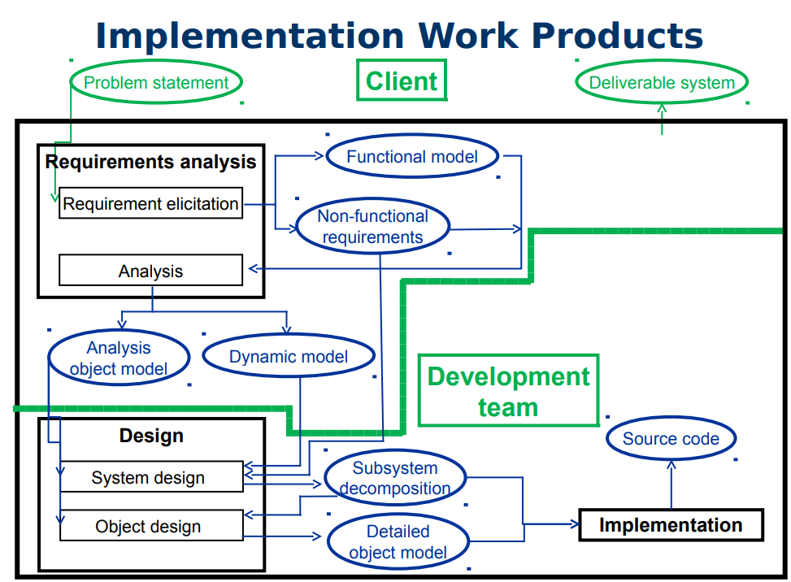

### Implementation is where things start to go wrong...
  - Problems
    - integration of subsystems developed by different teams
      - different handling of contract violations
      - undocumented changes to API
      - undocumented changes to classes and persistent data
    - delivery pressure
    - improvisations and workarounds
  - These add up to code that doesn’t match the design
  
### Model Transformation
  - What is model transformation?
    - changes applied to an existing object model
    - results in a new object model
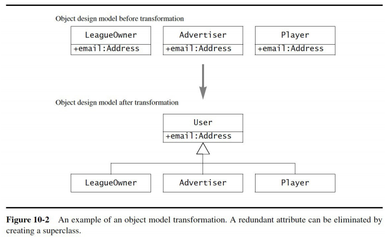
  - Goal
    - simplify
    - optimize
    - get closer to meeting requirements
    - improving one aspect of a model while preserving all its other
properties
  - Characteristics
    - localized
    - affect a small number of classes, attributes, operations
    - executed in series of small steps
    - can occur anytime in:
      - object design
      - implementation
  - Optimizing class model
    - focus on performance requirements
    - reduce multiplicity of associations
    - add redundant associations for efficiency
    - add derived attributes
  - Realizing associations
    - map associations to source code constructs
      - references
      - collections of references
  - Mapping contracts to exceptions
    - describe behaviour of operations when contracts are broken
      - where/when exceptions are raised
      - where exceptions are handled (at what layer)
  - Mapping class model to storage schema
    - define how class model relates to selected storage schema
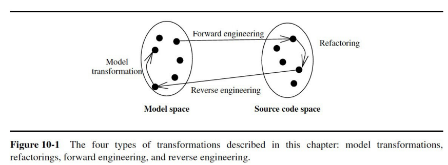

#### Refactoring
  - Goal of refactoring
    - improve the design of the system
  - Characteristics
    - applied to source code
    - improves readability or modifiability without changing behaviour
    - performed in small, incremental steps, interleaved with testing
    - focus on one attribute or operation at a time
  - Example: generalize an attribute
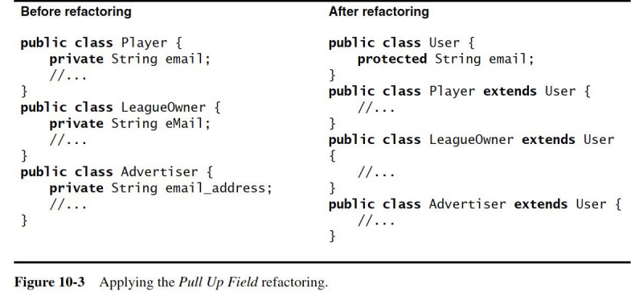
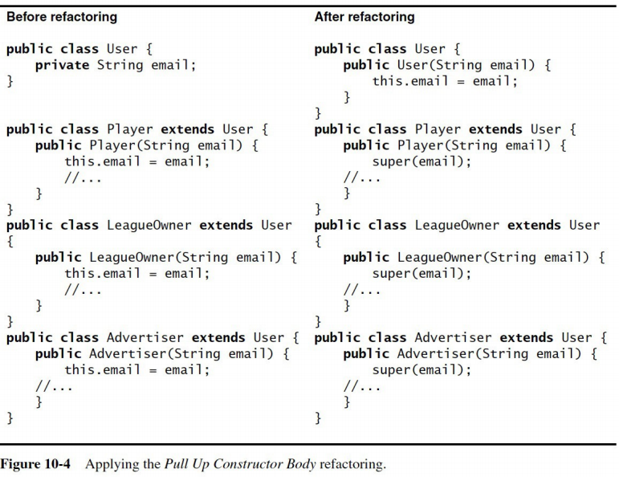
#### Forward engineering
  - What is it: Writing the code
  - Goal
    - maintain correspondence between object design model and code
    - reduce number of implementation errors
  - Characteristics
    - applied to a set of model elements
    - results in a set of corresponding source code statements
      - class definition
      - language expression
      - database schema
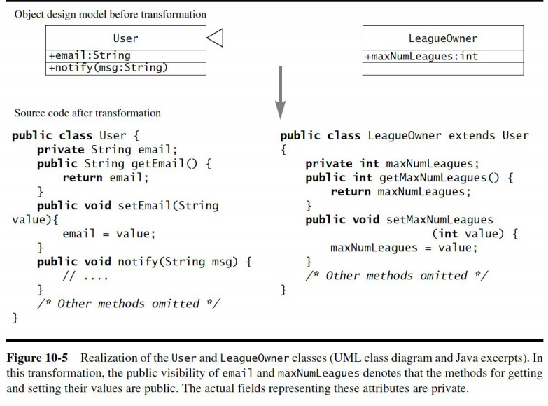
#### Reverse engineering
  - What is it: inferring the model from the code
  - Goal
    - recreate the model for an existing, already implemented system
  - Characteristics
    - applied to a set of source code elements
    - results in a set of model elements
    - inverse transformation of forward engineering
#### Transformation principles
  - Overall approach
    - improve the design of the system with respect to some criterion
    - not introduce new errors
  - Principles
    - each transformation must address a single criterion
      - one transformation to meet one design goal
    - each transformation must be local
      - only a few classes or operations at once
      - changes to many subsystems are an architectural change(not a transformation)
    - each transformation must be applied in isolation of other changes
      - one transformation at a time
    - each transformation must be followed by a validation step
      - validate each transformation after it is made
      - update appropriate models and documents
### Optimizing the Object Model
   - Optimizing access paths
    - repeated association traversals
      - identify frequent operations that require multiple association traversal
      - these should have direct connections instead
      - results in redundant connections, but may improve bottlenecks
    - “many” multiplicity associations
      - replace with “one” multiplicity qualified association
        - uses keys or indexing into objects on the “many” side
    - misplaced attributes
      - for attributes involved in only get/set operations, fold into calling class
      - may result in fewer classes
  - Result
    - selected redundant associations
    - fewer inefficient many-to-many associations
    - fewer classes
  - Collapsing objects
    - objects may be replaced by attributes
    - special behaviour may have to be moved
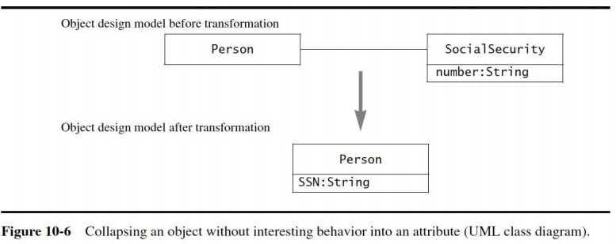
  - Delaying expensive computations
    - if some objects are expensive to create, wait until they are needed
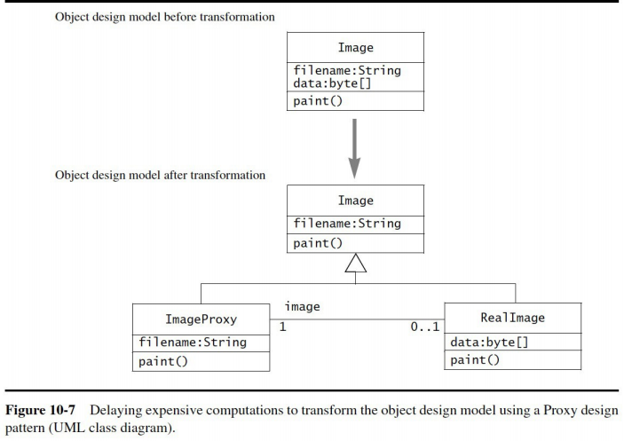
  - Caching the results of expensive operations
  - Caching is suitable for:
    - frequently called operations
    - operations whose internal values seldom change
  - Approach
    - internal values can be cached in private attributes
    - involves space/time trade-of

### Mapping Contracts
  - How are contracts mapped?
    - use exception handling to deal with contract violations(try/throw/catch)
  - Approach
    - it’s easy to overdo this
    - if we check every precondition, postcondition, and invariant
      - it’s too much work
      - we may introduce errors or mask existing bugs
      - code may get very convoluted
      - computational performance may take a hit
  - Heuristics
    - don’t check for postconditions and invariants(usually redundant)
    - focus on system interfaces
      - check the public operations
      - don’t bother checking private or protected operations
    - focus on long-life components
      - special attention to code most likely to be reused
    - reuse constraint checking code
      - operations with similar preconditions can use encapsulated code
    - exception classes can be shared

## Mapping to Collections

### Mapping Associations
  - Mapping associations to programming constructs
    - associations are implemented as:
      - single references: one object stores a handle to another object
      - collections: one object stores references to several objects of the same class
    - references are unidirectional between two objects
  - Implementing different kinds of associations
    - unidirectional one-to-one
      - Mapped as reference within source object to destination
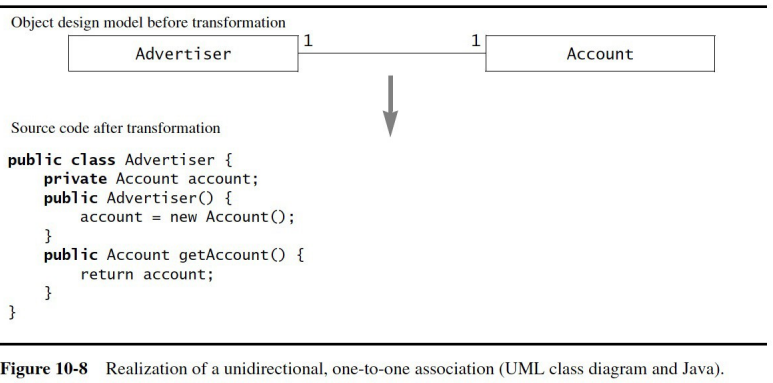
    - bidirectional one-to-one
      - Mapped as:
        - a reference within source object to destination object
        - a reference within destination object to source object
      - Consistency must be ensured
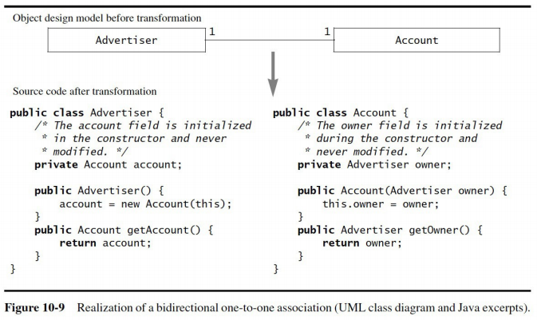
    - one-to-many
      - Within source object, collection of references to destination
      - May be unidirectional or bidirectional
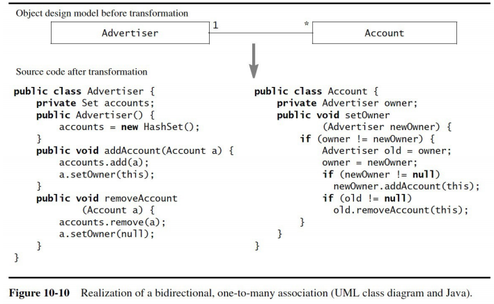
    - many-to-many
      - Mapped as:
        - within each source object, collection of references to destination
        - within each destination object, collection of references to source
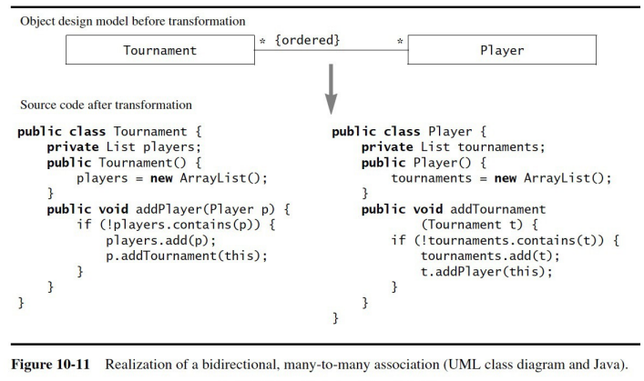
  
### Optimizing Associations
  - Associations with a “many” side can be problematic
    - can be slow to access
    - can be difficult to maintain consistency
  - Solutions: qualified associations and association classes
  
  - qualified associations
    - used to reduce multiplicity on the “many” side of an association
    - can be used with one-to-many or many-to-many associations
    - Mapped as:
      - additional qualifier attribute on the destination object
        - must have a unique value
      - a keyed collection (e.g. Map) on the source object, with:
        - key is the destination object qualifier
        - value is the destination object
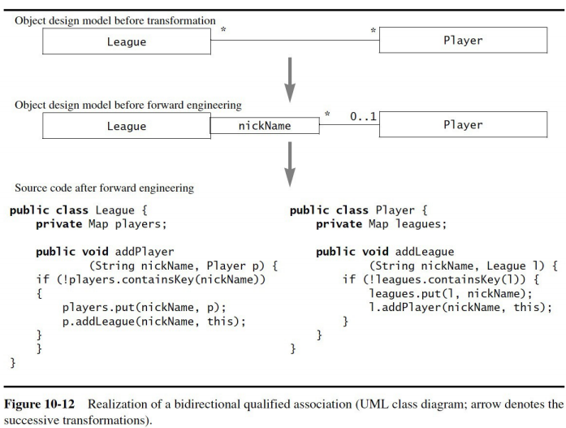

  - association classes
    - used to hold attributes and operations specific to an association
    - implemented as separate object with binary associations
    - each binary association mapped to set of reference attributes

## Mapping to Storage

### Relational Database Concepts
  - Schema
    - description of data
    - set of attributes stored for each object
    - also known as meta-model for data
  - Primary key
    - set of attributes whose values uniquely identify a data record
    - used to refer unambiguously to a specific data record
  - Foreign key
    - attribute that references a primary key in another table
    - links a data record in one table to more records in another table
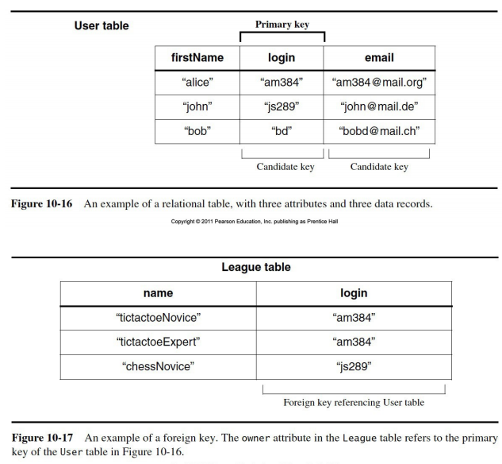

### Mapping Classes and Attributes
  - Correspondences between object model and schema
    - class: table
    - attribute: column
    - instance: row
  - Match same names in object model and schema
    - provides traceability
  -  Mapping attribute types
    - some constraints may have to be added to the object model(ex: max string length)
  - Primary key
    - choose a set of class attributes
      - problem if key values change
      - problem if application domain changes
    - add a unique identifier
      - more robust
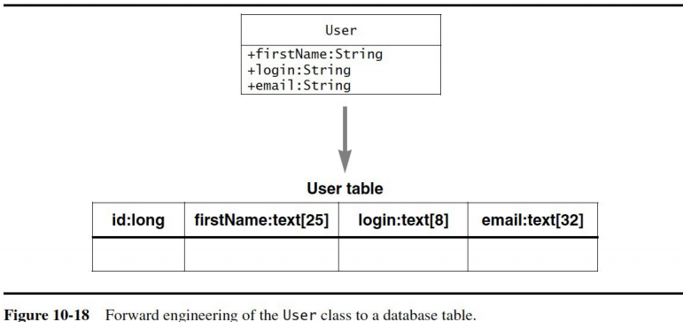

### Mapping Associations
  - Buried association
    - used to implement one-to-one and one-to-many associations
    - one-to-one: include foreign key of destination object in record of source object (and vice-versa for bidirectional association)
    - one-to-many: include foreign key of source object (“one” side) in records of destination objects (“many” side)
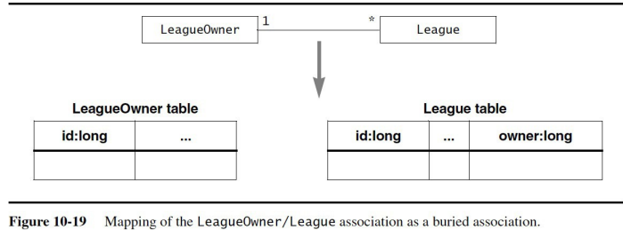
  - Association table
    - used to implement many-to-many associations
    - create a new two-column table with foreign keys for both classes in the association
    - each row corresponds to one link
    - can be used for one-to-one and one-to-many
      - increases the number of tables
      - increases the time required to traverse associations
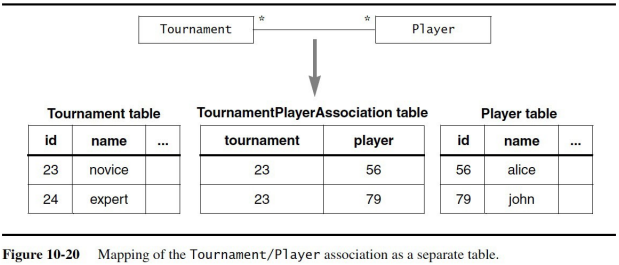

### Mapping Inheritance Relationships
  - Vertical mapping
    - superclass and subclass each have their own table
    - superclass table:
      - contains superclass attributes
      - includes additional attribute for name of record’s actual subclass
    - subclass table:
      - contains subclass attributes
      - shares same key as superclass table
    - access to one object involves multiple table retrievals
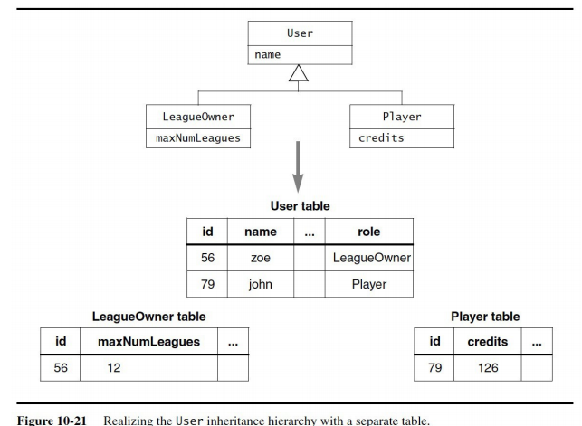
  - Horizontal mapping
    - only the subclass has a table
    - includes attributes from superclass and subclass
    - access to one object involves a single table retrieval
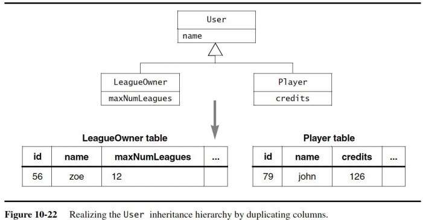
  - Trade-offs
    - vertical mapping
      - adds to access time with multiple table retrievals
      - facilitates modifiability, e.g. when adding attributes to superclass
    - horizontal mapping
      - duplicates superclass columns for each subclass
      - schema modifications are more complex
      - queries are faster, especially with deep inheritance
