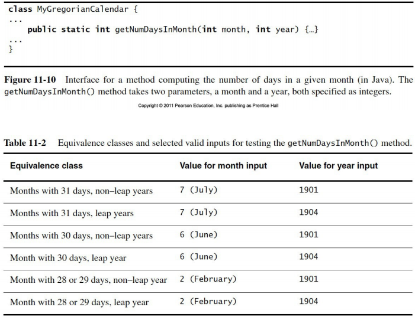
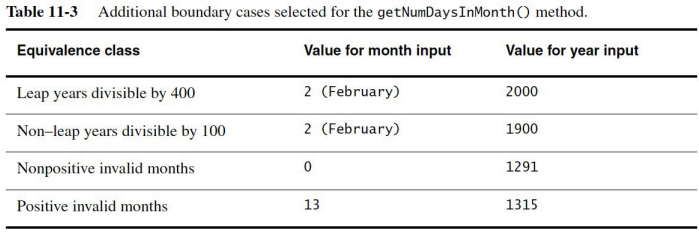
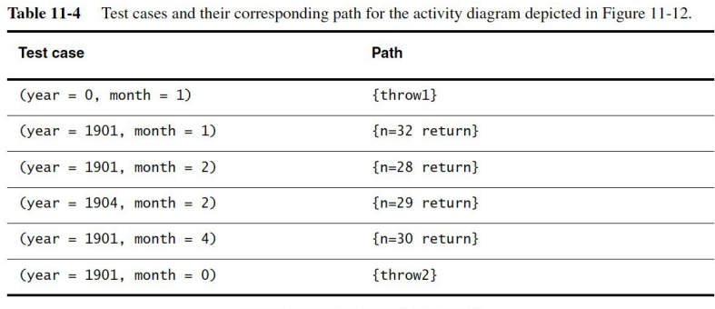
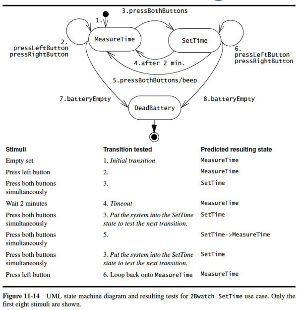
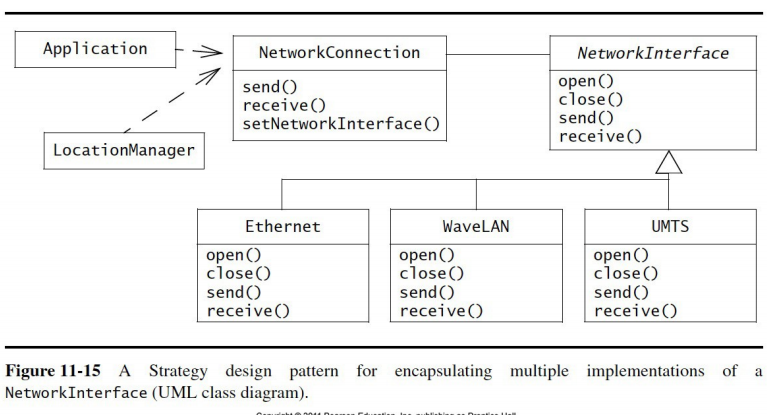
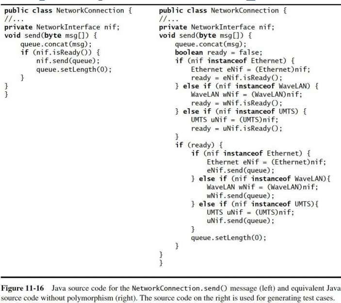

## Testing
  - Input to testing
    - functional model
    - non-functional requirements
    - subsystem decomposition
    - source code
  - Output from testing
    - deliverable system

  - What is testing?
    - the process of finding differences between:
      - specified system behaviour
      - observed system behaviour
    - systematic attempt to find faults in a planned manner
  - Purpose
    - break the system
    - testing is based on the falsification of system models
  - How do we test software?
    - design tests that expose the defects in the system
  - Who does the testing?
    - developers not involved in design or implementation
    - specialized testers
  Terminology
    - failure:
      - deviation of observed behaviour from specified behaviour
    - error state:
      - system is in a state where further processing will lead to failure
    - fault:
      - a defect or bug
      - the mechanical or algorithmic cause of an error

### Testing Basic Concepts

#### Software reliability
  - degree to which observed behaviour conforms to specification
  - Techniques for increasing reliability
    - fault avoidance
      - detect faults statically, without model execution
      - prevent faults before system is released
      - includes:
        - use of development methodologies
        - configuration management
        - verification
    - fault detection
      - identify error states and faults before release
      - includes
        - debugging (uncontrolled)
        - testing (controlled)
    - fault tolerance
      - cope with faults and system failures
      - recover from faults and failures at runtime
        - for example, using redundant components
        
#### Code reviews
  - manual inspection of parts of the system without execution
  - performed by review team
  - Two types of review
    - walkthrough
      - developer presents the code
    - inspection
      - review team checks everything
  - Goal of code reviews
    - check code against requirements
      - both functional and non-functional
    - check for algorithm efficiency
    - check accuracy and completeness of comments
    
#### Testing approach
  Main things to check
  - wide range of inputs
  - invalid inputs (e.g. outside range, zeros, wrong data type)
  - boundary cases
  - test planning
  - usability testing
  - unit testing
  - integration testing
  - system testing
    - functional testing
    - performance testing
    - acceptance testing
    
#### Blackbox and whitebox testing
  - Blackbox
    - test cases are not based on the code’s internal structure
    - focus is on input/output behaviour of test component
    - ignores internal aspects of component
  - Whitebox
    - test cases are based on the code’s internal structure
    - focus is on internal structure of the test component
    - ensures that everything is tested:
      - every state in the dynamic model
      - all object interactions
  - Unit testing must include both blackbox and whitebox
  
#### Faults, error states, failures
  - Fault
    - Types of faults
      - algorithmic
        - may be introduced during implementation, design, or analysis
        - examples:
          - data structure overload
          - lack of initialization
          - performance problems
      - mechanical
        - occur even if implementation is correct
        - examples:
          - fault in the programming environment
          - power failure

  - State
    - An error state would be a train running on the track reaching that fault 
#### Test cases
  - set of inputs and expected results that exercise a component
  - goal is to cause failures and detect faults
  - Every test case has these attributes:
    - unique name
      - should be derived from associated requirement or component
    - component under test
      - operations, classes, subsystems being tested
    - input
      - set of input data or commands entered by actor (tester or test driver)
    - expected output
      - expected results against which output of test is compared
  - Test case development dependencies
    - functional testing
      - depends on functional model (use cases)
    - unit testing
      - depends on definition of subsystem interfaces
  - Test cases can be related by associations
    - aggregation
      - test case can be decomposed into a set of sub-tests
    - precedence
      - used to specify when one test case must precede another

#### Test stubs and drivers
  - Issue:
    - we need to test isolated components
      - some code has to call the test component
      - some code has to execute when the test component calls other code
    - we need to substitute the missing parts
  - Solution:
    - write test drivers to call the test component
    - write test stubs to simulate the called portions of code
  - Test driver
    - simulates part of the system that calls the test component
    - passes in the test inputs
    - displays the results of the test
  - Test stub
    - simulates the component that is called by the test component
    - provides the same API as the simulated component
    - must return expected value
    - must simulate exact behaviour or may cause test case failure
    - may be more efficient to use than actual called component
    
#### Corrections
  - a change to a component in order to repair a fault
  - can introduce new faults
  - Managing corrections
    - problem tracking
      - documentation of errors and code fixes
    - regression testing
      - re-execution of all prior tests after a code fix
      - ensures that all previously working functionality is intact
      - this should be as automated as possible
    - rationale maintenance
      - documentation of reasons for change
      - ensures that no new faults are introduced by violating previous assumptions
### Usability Testing
  - finding differences between system and user expectations
  - Possible problems
    - UI details
    - layout of screens
    - sequence of interactions
    - hardware
  - Possible approaches
    - developers set out test objectives
    - participants accomplish predefined tasks
    - developers observe and collect user performance data
  - Three types of usability tests
    - scenario test
      - users presented with scenario of system
      - developers gauge user reactions to how scenario models work tasks
      - can be achieved with story boards or prototypes
    - prototype test
      - users presented with software that implements key aspects of system
      - vertical prototype: one use case is completely implemented
      - horizontal prototype: a single layer is implemented
        - for example: UI prototype
    - product test
      - users presented with functional system
### Unit Testing
  - objects and subsystems in individual components
  - groups of objects can be tested after individual objects are tested
  - Characteristics
    - reduces complexity of testing process
    - facilitates finding and correcting faults
    - allows for parallelism in testing process
  - Candidate units
    - selected from object model and subsystem decomposition
    - all objects should be tested
    - at minimum, participating objects in use cases should be tested
    - subsystems can be tested after all its classes have been tested

### Techniques for Unit Testing
#### Equivalence testing
  - blackbox technique
  - minimizes the number of test cases
  - input is partitioned into equivalence classes
    - testing will behave similarly for all members of an equivalence class
  - only one member of each equivalence class is tested    
  - Equivalence testing strategy
    - identify equivalence classes
    - criteria for identifying equivalence classes
      - coverage: every input belongs to an equivalence class
      - disjointedness: no input belongs to more than one equivalence class
      - representation: any error occurring with one member occurs for all members
    - select test input
      - for each equivalence class, select one valid and one invalid input

#### Boundary testing
  - special case of equivalence testing
  - focus on conditions at the boundary of equivalence classes
  - Disadvantage: some kinds of errors will not be detected

#### Path testing
  - whitebox technique
  - identifies faults by exercising all possible paths through the code
  - strategy
    - construct flow graph for test component
    - design test cases so that every edge is traversed at least once
  - does not detect faults associated with:
    - code omissions
    - invariants of data structures

#### State-based testing
  - compares resulting state of system against expected state
  - class-based
  - strategy
    - for each state in state machine diagram, derive representative set of stimuli for each transition
  - similar to equivalence testing
  - achieving a given state can be complex

#### Polymorphism testing
  - all possible dynamic bindings must be tested
  - introduces new challenge to testing
  - strategy
    - expand source code to:
      - typecast polymorphic object into each possible subclass
      - invoke operation on subclass
    - construct flow graph
    - perform path testing

###  Integration Testing
  - small groups of components(components already unit tested)
  - Approach
    - unit testing verifies individual components
    - tested components can be grouped and tested together
    - more complex parts can be tested incrementally
  - Ordering of component testing can optimize the process
    - horizontal integration testing strategies
      - components are integrated according to layers
    - vertical integration testing strategies
      - components integrated according to functionality

### Horizontal integration testing strategies

#### Big Bang Testing
  - Approach
    - unit test each component
    - throw everything together
  - Disadvantage
    - difficult to determine:
      - where the faults occur
      - which components fail
#### Bottom-Up Testing
  - Approach
    - unit test all the bottom layer components
    - integrate with the next layer up
    - repeat
  - Characteristics
    - requires that test drivers be implemented
    - equires no test stubs

#### Top-Down Testing
  - Approach
    - unit test all the top layer components
    - integrate with the next layer down
    - repeat
  - Characteristics
    - requires that test stubs be implemented
    - requires no test drivers

#### Bottom-Up vs. Top-Down Testing
  - Bottom-up testing
    - advantage: finds interface faults more easily
    - disadvantage: UI subsystems are tested last 
  - Top-down testing
    - advantage: starts with UI testing
    - disadvantage: large number of test stubs must be developed
    
#### Sandwich Testing
  - Approach
    - combines top-down and bottom-up
    - system is divided into:
      - target layer
      - layer above target layer
      - layer below target layer
    - top-down and bottom-up testing conducted in parallel
    - top-down: top layer is tested incrementally with target components
    - bottom-up: bottom layer is tested incrementally with target components
  - Characteristics
    - requires no test drivers and no test stubs
    - disadvantage: target components are not unit tested

#### Modified Sandwich Testing
  -Approach
    - similar to sandwich testing
    - test the three layers individually before testing together
    - first step: individual layer tests
      - top layer tested, with stubs for target layer
      - target layer tested, with drivers for top layer and stubs for bottom
      - bottom layer tested, with drivers for target layer
    - second step: combined layer tests
      - top layer accesses target layer
        - replace the test drivers with top layer components
      - bottom layer is accessed by target layer
        - replace the test stubs with bottom layer components
  - Characteristics
    - advantage: parallelism
    - disadvantage: requires additional test drivers and stubs

#### Vertical Integration
  - Vertical vs. horizontal integration testing strategies
    - in horizontal integration:
      - components are integrated in layers, based on subsystem decomp
    - in vertical integration:
      - all components for a given use case are fully implemented
      - these components are tested together
      - similar to prototyping, but prototypes are not releasable
      - disadvantages:
        - system evolves more incrementally
        - design is more subject to change

### System Testing

#### Functional Testing
  - Characteristics of functional testing
    - also known as requirements testing
    - blackbox technique
    - test cases are derived from Requirements Analysis Document
  - Goal is to find differences between:
    - the system and the functional requirements
    - the use case model and the observed system behaviour
  - Strategy
    - inspect the use case model
    - identify scenarios that are likely to cause failures
    - exercise common and exceptional use cases

#### Performance Testing
  - Goal is to find differences between:
    - the system and the design goals selected during design
  - Test cases are derived from:
    - System Design Document
    - Requirements Analysis Document
  - Performance testing includes:
    - stress testing
      - checks if system can respond to multiple simultaneous requests
    - volume testing
      - finds faults associated with large amounts of data
    - security testing
      - finds security faults in the system
      - one approach: white hat hackers try to break in
    - timing testing
      - find system behaviours that violate timing constraints
    - recovery testing
      - evaluate the ability of the system to recover from error states
  - System is deemed validated if:
    - functional and performance testing produce no failures
    
#### Acceptance Testing
  - Final phases of testing before client accepts the system
    - field testing
      - goal
        - install the system for selected group of users
        - collect feedback from users
      - types of field testing
        - alpha test: field test with system in development environment
        - beta test: field test with system in target environment
      - unlike usability tests, user behaviour is not observed
    - acceptance testing
      - client evaluates the system
      - three possible tests:
        - benchmark testing: selected users evaluate the system against requirements
        - competitor testing: system is tested against another product
        - shadow testing: new and legacy systems are executed in parallel
    - installation testing
      - system is installed in target environment
      - functional and performance tests are repeate
