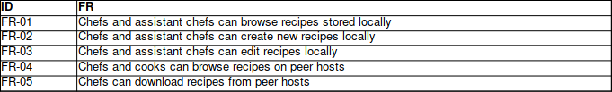

# COMP3004 Final Exam Practice Question Answers

## Multiple Choice (Concepts)

FIXME: answers up to 9 are done; need to do the rest

1. B (and probably D as well)
1. C
1. A
1. B
1. C
1. D
1. C
1. B
1. A

## Short Answer (Concepts)

### Question 1

- Functional: This category is important as it specifies *what* the application needs to be able to do from the client's point of view. It is impossible to make an application the client wants to use without knowing what they want to use it for.
- Usability: This category is an important NFR because it specifies quality constraints on the ease of use of the software. It is important to make software that is easy and effective for the client to use.
- Reliability: This category is an important NFR because the client needs to know that the application they are going to be using is robust and safe against faults and errors, both in the software and recovering from physical errors such as power failure.
- Performance: This category is important because it outlines performance-related NFRs. A user would not want to use a program that performs trivial actions in unnecessarily large amounts of time. They also wouldn't want to use an application that takes way more space on their hard drive than necessary.
- Supportability: This category is important because it specifies the limitations of the system in the context of physical hardware and the software environment the system is expected to run on. A client with a mixture of UNIX-like and DOS-based systems is not going to want to use an application that runs on windows only.
- Implementation: This category is important because it allows the designers to specify any constrains on the implementation of the system. Such constraints might include what programming language is suited to the client's needs, what types of libraries might be available to use, etc.
- Interface: This category is important because it specifies any constraints on how the application will interface with external actors such as users, external systems, etc. For example, will the application use a GUI? What APIs will it use? What API(s) will it offer, if any?
- Operation: This category is important as it specifies constraints on the operation of the system. Which users are allowed to use which parts of the application? Do users have to sign in? Are users constrained in terms of how many resources they can use at a time?
- Packaging: This requirement category is important to describe constraints on how the application is packed when it is delivered. What is included with the full system? Does it come with documentation? How is the system installed?
- Legal: This requirement is important as it specifies any legal constraints on the application. These would likely be copyright laws, privacy laws, or laws related to the client's application domain.

### Question 2

- Functional model
    - related to the functional requirements of the system
    - work products:
        - FR (and NFR) table
        - scenarios
        - scenario tables
        - actors
        - use cases diagrams
        - use case tables
- Object model
    - related to the objects in the system
    - work products:
        - initial analysis object glossary
        - class diagrams for entity, boundary, control objects
        - data dictionaries for entity, boundary, control objects
- Dynamic model
    - related to system behavior
    - work products:
        - sequence diagrams
        - activity diagrams
        - state machine diagrams

### Question 3

It would be very irresponsible for Jack to do this. Traceability is critical for having a system model that is easy to modify in the future. For example, if Jack decided to eliminate a NFR from his list of NFRs, he would need an easy way to search for that NFR everywhere else it is used in the model and modify where necessary. Without traceability, there is no easy way to do this.
Traceability also helps keep track of what requirements are being met in which parts of the system.

### Question 4

The design pattern being employed here is the proxy design pattern. The text description and the image itself are both inheriting from
some abstract image class. Each one reimplements a pure virtual member function that "displays" the image. This allows the browser to
display the proxy for the real image until it loads and leads to a better and more dynamic user experience.

TODO: draw a picture of this

### Question 5

TODO: finish this in a few minutes

The Facade design pattern is used to

The Bridge design pattern is used to

### Question 6

A scenario can be thought of as an instance of a use case. It involves instantiated actors and initial analysis objects.
Scenarios should be done first as they can help establish an understanding between the client and designers and bootstrap the creation
of the actual use cases down the road (once we figure out which scenarios are good and which are garbage).

### Question 7

The includes relationship is used to abstract use cases that include redundant steps or to break down complex functionality into smaller
parts.

The extends relationship is used for exceptions; functionality that is not normal, but is instead triggered by some event within the use case. This is useful for error messages.

These are not interchangeable and most often the includes relationship should be used. Extends is only useful for error messages.

### Question 8

Shared aggregation is a weaker form of aggregation than composition. In shared aggregation, another class can
aggregate the same class that is already being aggregated and the class that is being aggregated can exist elsewhere in the program.

On the other hand, composition is a much stronger form of aggregation. If class A has a composition relationship with class B, it means
that B is a part that makes up the complete form of A. B cannot exist anywhere else in the program.

By the logic above, class A can be composed of class B and class C. But class A and class B cannot both be composed of class C.

### Question 9

State machine diagrams deal with system state at each step in the use case. Each state has one or more arrows flowing out of it
to another state(s), labeled with the condition required to take that path. State machine diagrams have a starting and an end state.

Activity diagrams deal with system activities at various stages in a use case. Each activity has one arrow flowing from/to it
and these arrows can be split by vertical bars and diamonds which represent conditionals. The activity diagrams also have a starting
and an ending point. Finally, an activity diagram can have "swim lanes" which represent the flow of control between various actors
and objects.

### Question 10

You should use an adapter pattern here. The adapter pattern will allow you to build a modern GUI front end on top of the old
`bc` program. You can make API calls to `bc` (probably via the pipe and filter architecture since `bc` is an older UNIX program)
in order to make it work with your GUI.

### Question 11

## Long Answer / Diagrams

### myRecipes

## Short Answer (Ethics)

1.
