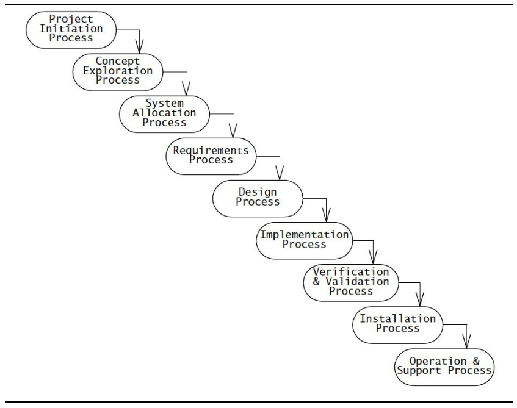
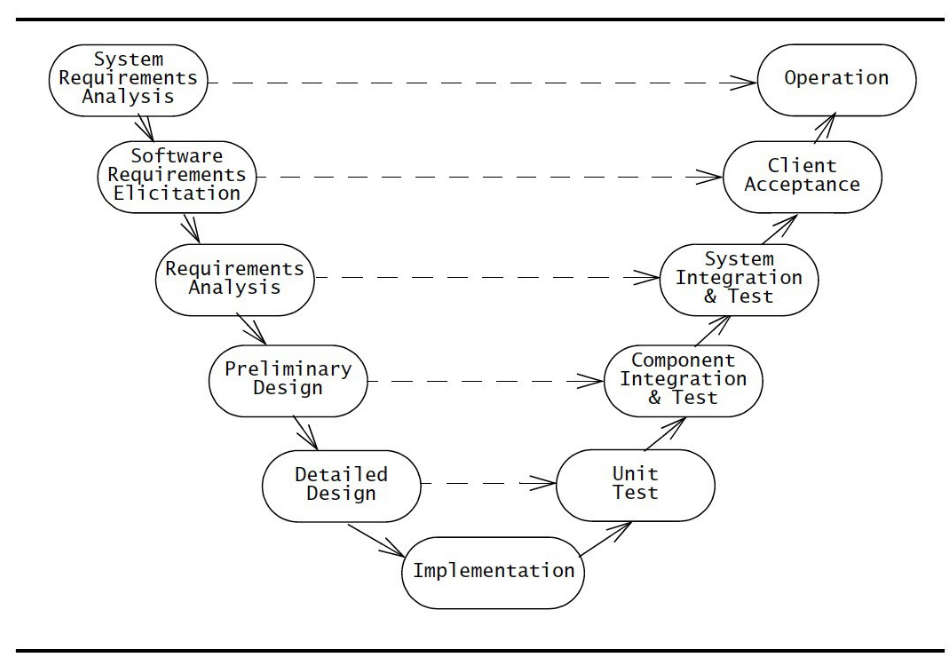

# COMP3004 Final Exam Notes

## Software engineering

### What is it?

- requirements analysis
- building a software system to accomplish a task
    - a software system is big and complex
    - not just a dinky little program
- reliable, modifiable process

### Why is it necessary?

- huge systems and projects difficult to manage
- we need a plan
- reliability, modifiability

## Build models

- functional model

- dynamic model

- object model

### Why do we need them?

- get an idea of full system
- requirements
- clarify details
- make sure client and design team on the same page

### What are they?

- functional model
    - FR, NFR (table, FURPS+)
    - use cases (diagrams, tables)
        - high level (don't forget the box!)
        - detailed (includes and extends)
- dynamic model
    - state machine diagrams(s)
    - activity diagram(s)
    - sequence diagram(s)
- object model
    - class diagram(s)
    - data dictionaries

### Traceability -- what and why?

- number entries in tables for traceability
    - esp. FR/NFR and data dictionary
- helps with maintenance of design

## Software development life cycle

### Phases and work products of each

1. Requirements Elicitation
    - work products? the functional model!
        - FURPS+ table
        - use case diagram
        - scenarios, use cases
1. Analysis
    - work products? the object and dynamic models!
        - class diagrams
        - activity / sequence / state machine diagrams
1. High Level System Design
    - work products?
        - system architecture
        - subsystem decomposition
1. Detailed Object Design
    - work products?
        - detailed object model
1. Implementation
    - work products?
        - source code
1. Testing
    - work products?
        - deliverable system
1. Deployment / Maintenance
    - work products?
        - future versions of the deliverable system

- where does the client's knowledge end and begin again?
    - ends right after analysis
    - starts up again for system testing (after integration testing)

## Models in requirements analysis

### Object model

- TODO: work on me!!

### Dynamic model

- TODO: work on me!!

### Functional model

- TODO: work on me!!

## Requirements elicitation

### Why do it?

- actors
- scenarios
- use cases and relationships (and FRs)
- analysis objects
- NFRs
- "a better understanding of what the client wants"

### FR and NFR (FURPS+)

- FURPS+
    - F: **Functional**
        - if you can make a use case for it, it's functional
        - and vice versa
        - "what can the actors do with the system?"
    - U: **Usability**
        - ease of use requirements
    - R: **Reliability**
        - recover from error
        - stability
        - security
    - P: **Performance**
        - performance metrics
        - task X should be complete within Y seconds on a dataset of size Z
    - S: **Supportability**
        - future maintainability
        - what kinds of platforms/hardware can the system run on?
    - +: **Implementation**
        - implementation-specific requirements
    - +: **Interface**
        - how system interacts with actors (GUI, CLI, etc) -- boundary object requirements
        - how it interacts with external systems
    - +: **Operation**
        - which users are allowed to do what
        - constraints on operation
    - +: **Packaging**
        - how the system should be delivered to the customer
    - +: **Legal**
        - any legal cosntraints on the system
        - privacy laws, application-domain-specific laws, etc.
- FURPS+ should be measurable, **reasonable**, specific -- don't state the obvious
    - not as simple as "the system should be easy to use"

### Scenarios table

- scenarios are instances of use cases
- they help us find the actual use cases
- what does the table look like?
    - name
    - actors (these get instantiated -> jimmy:staff, matilda:student, :RegistrarSystem, :FinanceSystem)
    - flow of events

### UML use case diagrams

- don't forget the system box
- high level is pretty abstract
- lower level is actually what's happening
- "initiates" and "participates" for actors
    - "initiate" species access control
- "includes" and "extends" for use cases
    - "extends" is for **errors only**, arrow goes opposite direction
    - "includes" is for breaking down redundant/complex functionality

### Use case tables

- name
- id (traceability of use case)
- participating actors
    - initiated by X
    - Y participates
- flow of events
    - what happens from the actors' point of view?
- entry condition
    - what has to be true about the system to enter
- exit condition
    - what is true about the system when we exit
- quality requirements and traceability of quality requirements
    - NFRs and their numbers -> relevant to the use case

### Initial analysis object glossary

- look for common key words
- these become initial objects
- collect them in a glossary

## Analysis

### Object model

- objects come from FRs, use cases
- entity, boundary, control
- work products?
    - class diagrams
    - data dictionary

#### Aggregation

- how does it work?
    - diamond on one side, arrow on the other (but we omit the arrow)
    - cardinality -> 1..\* or 0..\* or \* or 1 etc.
- **shared** (white diamond)
    - other classes can aggregate what we are aggregating
- **composition** (black diamond)
    - we are "composed" of what we are aggregating
    - it can't exist anywhere else in the program
- **bi-directional**
    - has-a relationship in two directions
    - no arrows or diamonds

#### Inheritance

- is-a relationship
- this is pretty simple

#### Data dictionary

- entity objects
    - object name
    - attributes and associations
    - definition
- boundary objects
    - object name (high level -> always "option" or "reply" or "request" or "notification")
    - definition
- control objects (one per use case, or one per actor per use case)
    - object name
    - definition

### Dynamic model

- dynamic model comes from use cases
- work products?
    - sequence diagrams
    - activity diagrams
    - state machine diagrams

#### Sequence diagrams

- actor and boundary lifeline -> lasts forever
    - very rarely this will make sense for something else
    - for example, persistent storage that is not external to the system
- pretty much everything else gets created and has a lifeline that ends in an X
    - even the control objects
1. actor selects option
1. option creates control object
1. control object takes over
1. control object creates request
1. request sends
1. control object creates reply
1. receiver object or actor sends the reply
1. control creates notification object
1. notification object notifies user

#### Activity diagrams

- TODO: add me

#### State machine diagrams

- TODO: add me

## High level system design

### Design goals

- TODO: work on me!!

### Subsystem decomposition

- TODO: work on me!!

### System design strategies

- TODO: work on me!!

## Detailed object design

### Types of inheritance

- TODO: work on me!!

### Liskov's principle

- TODO: work on me!!

### Contracts

- TODO: work on me!!

## Implementation

### Mapping objects to collections

- TODO: work on me!!

### Model transformations

- TODO: work on me!!

### Mapping associations to collections

- TODO: work on me!!

### Mapping associations to storage

- TODO: work on me!!

### Buried associations

- TODO: work on me!!

### Association tables

- TODO: work on me!!

### Vertical/horizontal mapping of inheritance to storage

- TODO: work on me!!

## Testing

### Blackbox vs whitebox

- TODO: work on me!!

### Unit testing (path, equivalence, boundary, state, polymorphism)

- TODO: work on me!!

### Integration testing (top-down, bottom-up, sandwich, modified sandwich, test stubs, test drivers)

- TODO: work on me!!

### System testing (functional, performance)

- TODO: work on me!!

## Software development life cycle model

### Agile

- emphasis on implementation phase
- some requirement analysis
- minimal design
- testing concurrent with implementation

#### Advantages?

- shorter delivery times
- faster response to change

### Waterfall

- activity-centered
- sequential, simple approach
- constantly verify at each step

#### Advantages?

- never revisit an activity once completed
- constant verification at each step

### V-model

- variation of waterfall
    - activity-centered
    - sequential, simple approach
    - constantly verify at each step
- arranged as a V shape
    - shows abstraction levels
    - horizontal arrows depict information flow within abstraction level

#### Advantages?

- depicts level of abstraction
    - requirements
    - architecture
    - code

### Spiral

- activity-centered
- iterative execution of activities
- address risks in order of priority
- four phases
    1. objectives, constraints, alternatives
    1. risks
    1. prototype
    1. plan next round

#### Advantages?

- address frequent changes during development

## Ethics

### Professionalism

- TODO: work on me!!

### Code of ethics

- TODO: work on me!!

### Process for making ethical decisions

- TODO: work on me!!
