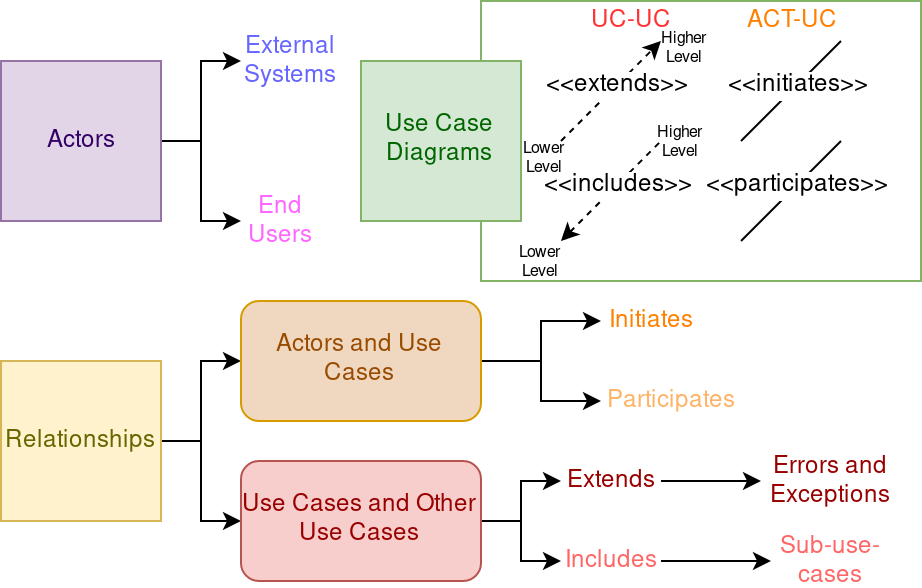

# COMP3004 Final Exam Notes

## Software engineering

### What is it?

- requirements analysis
- building a software system to accomplish a task
    - a software system is big and complex
    - not just a dinky little program
- reliable, modifiable process

### Why is it necessary?

- huge systems and projects difficult to manage
- we need a plan
- reliability, modifiability

## Build models

- functional model

- dynamic model

- object model

### Why do we need them?

- get an idea of full system
- requirements
- clarify details
- make sure client and design team on the same page

### What are they?

- functional model
    - FR, NFR (table, FURPS+)
    - use cases (diagrams, tables)
        - high level (don't forget the box!)
        - detailed (includes and extends)
- dynamic model
    - state machine diagrams(s)
    - activity diagram(s)
    - sequence diagram(s)
- object model
    - class diagram(s)
    - data dictionaries

### Traceability -- what and why?

- number entries in tables for traceability
    - esp. FR/NFR and data dictionary
- helps with maintenance of design

## Software development life cycle

### Phases and work products of each

1. Requirements Elicitation
    - work products? the functional model!
        - FURPS+ table
        - use case diagram
        - scenarios, use cases
1. Analysis
    - work products? the object and dynamic models!
        - class diagrams
        - activity / sequence / state machine diagrams
1. High Level System Design
    - work products?
        - system architecture
        - subsystem decomposition
1. Detailed Object Design
    - FIXME: add work products
1. Implementation
    - FIXME: add work products
1. Testing
    - FIXME: add work products
1. Deployment / Maintenance
    - FIXME: add work products

- where does the client's knowledge end and begin again?
    - ends right after analysis
    - starts up again half way through testing (once we start testing final system)

### Requirements elicitation

#### FURPS+ Tables

- FURPS+
    - F: functional
        - if you can make a use case for it, it's functional
        - and vice versa
        - "what can the actors do with the system?"
    - U: usability
        - ease of use requirements
    - R: reliability
        - recover from error
        - stability
        - security
    - P: performance
        - performance metrics
        - task X should be complete within Y seconds on a dataset of size Z
    - S: supportability
        - future maintainability
        - what kinds of platforms/hardware can the system run on?
    - +: Implementation
        - implementation-specific requirements
    - +: Interface
        - how system interacts with actors (GUI, CLI, etc) -- boundary object requirements
        - how it interacts with external systems
    - +: Operation
        - which users are allowed to do what
        - constraints on operation
    - +: Packaging
        - how the system should be delivered to the customer
    - +: Legal
        - any legal cosntraints on the system
        - privacy laws, application-domain-specific laws, etc.
- FURPS+ should be measurable, **reasonable**, specific -- don't state the obvious
    - not as simple as "the system should be easy to use"

#### Use Case Diagrams

- don't forget the system box
- high level is pretty abstract
- lower level is actually what's happening
- "initiates" and "participates" for actors
    - "initiate" species access control
- "includes" and "extends" for use cases
    - "extends" is for **errors only**, arrow goes opposite direction
    - "includes" is for breaking down redundant/complex functionality

#### Use Case Tables

- name
- id (traceability of use case)
- participating actors
    - initiated by X
    - Y participates
- flow of events
    - what happens from the actors' point of view?
- entry condition
    - what has to be true about the system to enter
- exit condition
    - what is true about the system when we exit
- quality requirements and traceability of quality requirements
    - NFRs and their numbers -> relevant to the use case

### Analysis

- TODO: work on me!!

### High-level system design

- TODO: work on me!!

### Detailed object design

- TODO: work on me!!

### Implementation

- TODO: work on me!!

### Testing

- TODO: work on me!!

### Deployment and maintenance

- TODO: work on me!!

## Models in requirements analysis

### Object model

- TODO: work on me!!

### Dynamic model

- TODO: work on me!!

### Functional model

- TODO: work on me!!

## Requirements elicitation

### Why do it?

- TODO: work on me!!

### FR and NFR (FURPS+)

- TODO: work on me!!

### Scenarios and use cases

- TODO: work on me!!

### UML use case diagrams

- TODO: work on me!!

### Use case tables

- TODO: work on me!!

## Analysis

### Object model

- TODO: work on me!!

### Dynamic model

- TODO: work on me!!

## High level design

### Design goals

- TODO: work on me!!

### Subsystem decomposition

- TODO: work on me!!

### System design strategies

- TODO: work on me!!

## Detailed object design

### Types of inheritance

- TODO: work on me!!

### Liskov's principle

- TODO: work on me!!

### Contracts

- TODO: work on me!!

## Implementation

### Mapping objects to collections

- TODO: work on me!!

### Model transformations

- TODO: work on me!!

### Mapping associations to collections

- TODO: work on me!!

### Mapping associations to storage

- TODO: work on me!!

### Buried associations

- TODO: work on me!!

### Association tables

- TODO: work on me!!

### Vertical/horizontal mapping of inheritance to storage

- TODO: work on me!!

## Testing

### Blackbox vs whitebox

- TODO: work on me!!

### Unit testing (path, equivalence, boundary, state, polymorphism)

- TODO: work on me!!

### Integration testing (top-down, bottom-up, sandwich, modified sandwich, test stubs, test drivers)

- TODO: work on me!!

### System testing (functional, performance)

- TODO: work on me!!

## Software development life cycle model

### Agile

- TODO: work on me!!

### Waterfall

- TODO: work on me!!

### V-model

- TODO: work on me!!

### Spiral

- TODO: work on me!!

## Ethics

### Professionalism

- TODO: work on me!!

### Code of ethics

- TODO: work on me!!

### Process for making ethical decisions

- TODO: work on me!!
