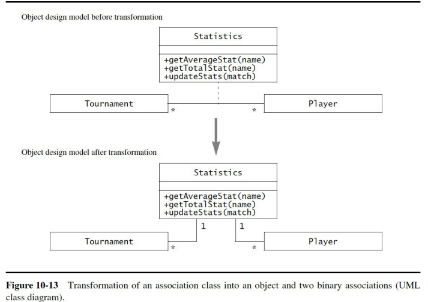
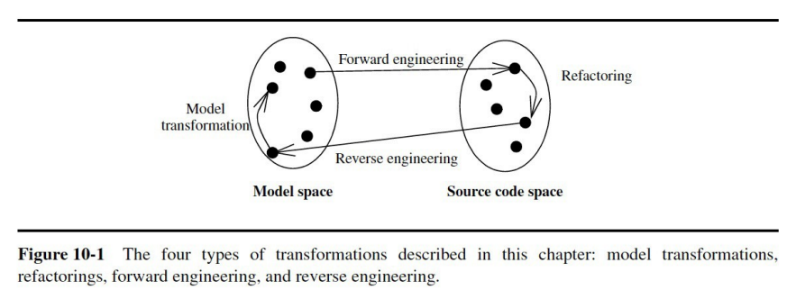
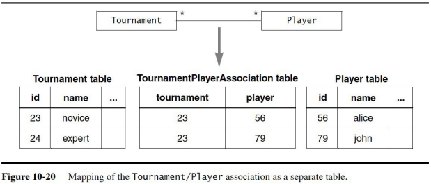
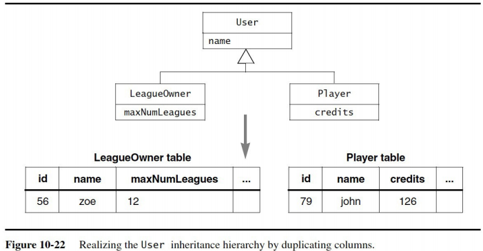
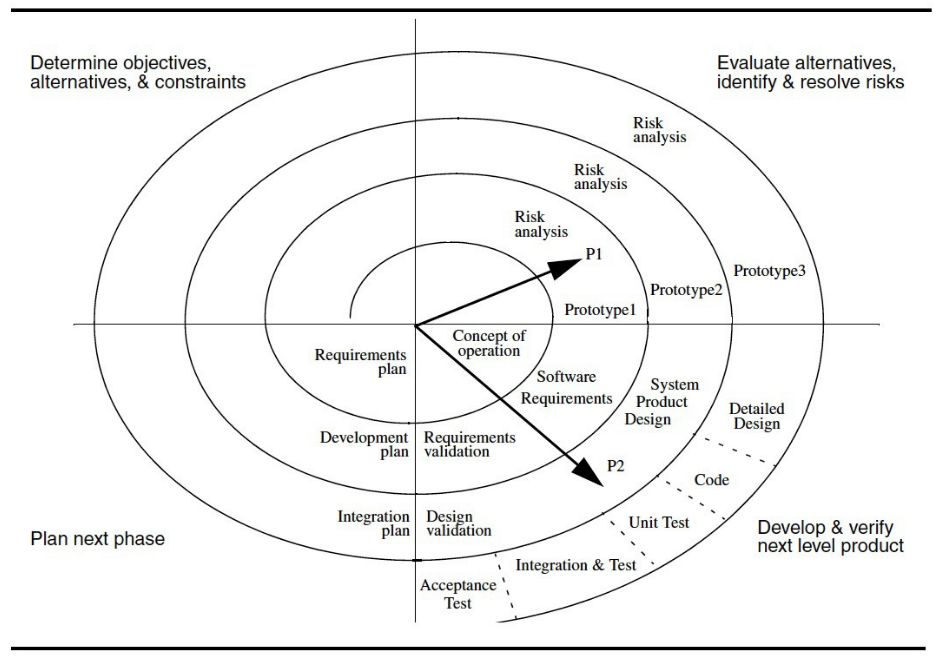

# COMP3004 Final Exam Notes

## Software engineering

### What is it?

- requirements analysis
- building a software system to accomplish a task
    - a software system is big and complex
    - not just a dinky little program
- reliable, modifiable process

### Why is it necessary?

- huge systems and projects difficult to manage
- we need a plan
- reliability, modifiability

## Build models

- functional model

- dynamic model

- object model

### Why do we need them?

- get an idea of full system
- requirements
- clarify details
- make sure client and design team on the same page

### What are they?

- functional model
    - FR, NFR (table, FURPS+)
    - use cases (diagrams, tables)
        - high level (don't forget the box!)
        - detailed (includes and extends)
- dynamic model
    - state machine diagrams(s)
    - activity diagram(s)
    - sequence diagram(s)
- object model
    - class diagram(s)
    - data dictionaries

### Traceability -- what and why?

- number entries in tables for traceability
    - esp. FR/NFR and data dictionary
- helps with maintenance of design

## Software development life cycle

### Phases and work products of each

1. Requirements Elicitation
    - work products? the functional model!
        - FURPS+ table
        - use case diagram
        - scenarios, use cases
1. Analysis
    - work products? the object and dynamic models!
        - class diagrams
        - activity / sequence / state machine diagrams
1. High Level System Design
    - work products?
        - system architecture
        - subsystem decomposition
1. Detailed Object Design
    - work products?
        - detailed object model
1. Implementation
    - work products?
        - source code
1. Testing
    - work products?
        - deliverable system
1. Deployment / Maintenance
    - work products?
        - future versions of the deliverable system

- where does the client's knowledge end and begin again?
    - ends right after analysis
    - starts up again for system testing (after integration testing)

## Models in requirements analysis

### Object model

- class diagrams
- data dictionaries
    - define objects
    - list attributes and associations
    - explain when an attribute is set

### Dynamic model

- state machines
- sequence diagrams
- activity diagram

### Functional model

- use case diagrams
- use case tables
- FR, NFR tables

## Design Patterns

- a set of classes and the associations between them
- Selection of original design patterns:
    - creational: they deal with object creation mechanisms
    - structual: they simplify the implementation of relationships between
    objects
    - behavioural: they realize common communication patterns between objects

### Creational

#### Abstract Factory

- Characteristics:
    - enables client-independent creation of objects
    - provides client with interface to classes with different
    implementations

- Solution for encapsulating platforms:
    - used for substituting fmaily of concrete products transparently from the client
    - ex: application with products from different manufacturers

### Structual

#### Adapter

- Characteristics:
    - wraps around existing code
    - sits between client and legacy code, prpoviding legacy services with a new
    interface

- Solution for encapsulating legacy components:
    - used for converting existing (legacy) component interface into one that the
    client expects
    - similar to **Bridge**, but for dealing with existing components
    - ex: new UI on an existing back end

#### Bridge

- Characteristics:
    - allows for alternate implementation, with a single interface

- Solution for encapsulating data stores:
    - used for substituting multiple realizationg of the same interace for
    different uses
    - ex: multiple implementaions of data store

#### Composite

- Characteristics:
    - represents a recursive hierarchy
    - leaves and composites provide a common interface
    - commands on composites propagated recursively over all its components

- Solution for encapsulating hierarchies:
    - used for representing recursive hierarchy, such as components and composties
    - ex: UI toolkits, such as Java Swing

#### Facade

- Characteristics:
    - used to encapsulate subsytems
    - provides high-level interface that uses lower-level class operations

#### Proxy

- Characteristics:
    - encapulates expensive (performance-wise, security-wise) objects
    - proxy objects provide a gateway to their corresponding real objects

### Behavioral

#### Command

- Characteristics:
    - used to encapsulate control flow
    - provides interface that groups operations on all requests

- Solution for encapsulating control flow:
    - used for providing generic user requests, without knowing content of request
    - ex: execute, undo, store

#### Observer

- Characteristics:
    - used to separate entity objects from view
    - changes to one object (publisher/subject) are communicated to interested
    parties (subscriber/observer)

- Solution for maintaining consistency:
    - used for propagating model changes acrosee views
    - ex: MVC architecture

#### Strategy

- Characteristics:
    - used to encapsulate algorithms
    - separate policy decides which algorithm performs a task

- Solution for encapsulating context:
    - used for dynamically substituting multiple realizations of the same interface
    for different contexts
    - similar to **Bridge**, but client decides which implementation to use
    - ex: substituting different network connections dynamically

## Requirements elicitation

### Why do it?

- actors
- scenarios
- use cases and relationships (and FRs)
- analysis objects
- NFRs
- "a better understanding of what the client wants"

### FR and NFR (FURPS+)

- FURPS+
    - F: **Functional**
        - if you can make a use case for it, it's functional
        - and vice versa
        - "what can the actors do with the system?"
    - U: **Usability**
        - ease of use requirements
    - R: **Reliability**
        - recover from error
        - stability
        - security
    - P: **Performance**
        - performance metrics
        - task X should be complete within Y seconds on a dataset of size Z
    - S: **Supportability**
        - future maintainability
        - what kinds of platforms/hardware can the system run on?
    - +: **Implementation**
        - implementation-specific requirements
    - +: **Interface**
        - how system interacts with actors (GUI, CLI, etc) -- boundary object requirements
        - how it interacts with external systems
    - +: **Operation**
        - which users are allowed to do what
        - constraints on operation
    - +: **Packaging**
        - how the system should be delivered to the customer
    - +: **Legal**
        - any legal cosntraints on the system
        - privacy laws, application-domain-specific laws, etc.
- FURPS+ should be measurable, **reasonable**, specific -- don't state the obvious
    - not as simple as "the system should be easy to use"

### Scenarios table

- scenarios are instances of use cases
- they help us find the actual use cases
- what does the table look like?
    - name
    - actors (these get instantiated -> jimmy:staff, matilda:student, :RegistrarSystem, :FinanceSystem)
    - flow of events

### UML use case diagrams

- don't forget the system box
- high level is pretty abstract
- lower level is actually what's happening
- "initiates" and "participates" for actors
    - "initiate" species access control
- "includes" and "extends" for use cases
    - "extends" is for **errors only**, arrow goes opposite direction
    - "includes" is for breaking down redundant/complex functionality

### Use case tables

- name
- id (traceability of use case)
- participating actors
    - initiated by X
    - Y participates
- flow of events
    - what happens from the actors' point of view?
- entry condition
    - what has to be true about the system to enter
- exit condition
    - what is true about the system when we exit
- quality requirements and traceability of quality requirements
    - NFRs and their numbers -> relevant to the use case

### Initial analysis object glossary

- look for common key words
- these become initial objects
- collect them in a glossary

## Analysis

### Object model

- objects come from FRs, use cases
- entity, boundary, control
- work products?
    - class diagrams
    - data dictionary

#### Aggregation

- how does it work?
    - diamond on one side, arrow on the other (but we omit the arrow)
    - cardinality -> 1..\* or 0..\* or \* or 1 etc.
- **shared** (white diamond)
    - other classes can aggregate what we are aggregating
- **composition** (black diamond)
    - we are "composed" of what we are aggregating
    - it can't exist anywhere else in the program
- **bi-directional**
    - has-a relationship in two directions
    - no arrows or diamonds

#### Inheritance

- is-a relationship
- this is pretty simple

#### Data dictionary

- entity objects
    - object name
    - attributes and associations
    - definition
- boundary objects
    - object name (high level -> always "option" or "reply" or "request" or "notification")
    - definition
- control objects (one per use case, or one per actor per use case)
    - object name
    - definition

### Dynamic model

- dynamic model comes from use cases
- work products?
    - sequence diagrams
    - activity diagrams
    - state machine diagrams

#### Sequence diagrams

- actor and boundary lifeline -> lasts forever
    - very rarely this will make sense for something else
    - for example, persistent storage that is not external to the system
- pretty much everything else gets created and has a lifeline that ends in an X
    - even the control objects
1. actor selects option
1. option creates control object
1. control object takes over
1. control object creates request
1. request sends
1. control object creates reply
1. receiver object or actor sends the reply
1. control creates notification object
1. notification object notifies user

**IMPORTANT: Please note the below diagram has a mistake!! The microwave actor should not be destroyed!!**

#### Activity diagrams

- start -> black dot
- arrows to activities
- bars split and join arrows for synchronization
    - fork node
    - join node
- diamonds for conditions
- swim lanes
    - break diagram into related lanes of activity
- end -> black dot with circle around it
    - looks like a target

#### State machine diagrams

- start -> black dot
- arrows to other states
    - all arrows except from start have a condition attached to them
    - bubbles with verb phrases describing what system is doing
    - what *state* is the system in
- end -> black dot with circle around it
    - looks like a target

## High level system design

### Design goals

1. performance
1. dependability
1. cost
1. maintenance
1. end user experience

### Subsystem decomposition

- high cohesion, loose coupling
    - services
- closed or open architecture
    - layers, partitions
- architecture styles
    - 3 tier
    - 4 tier
    - client-server
    - peer-to-peer
    - repository
    - MVC
    - pipe and filter

### Component diagrams

- ball and socket
- ball -> provides service
- socket -> uses service

### Packaging diagrams

- looks like "folders"
- subsystems inside subsystems
- inheritance and aggregation (just arrows, no diamonds)

### System design strategies

#### Persistent Data Management

#### Access Control

- static
- dynamic

#### Hardware/Software Mapping (Deployment Diagram)

- nodes
    - physical systems in a network
- runtime components
    - different processes

- deployment diagrams
- everything is instantiated
- components can support multiple subsystems

## Detailed object design

### Types of inheritance

- Impact of inheritance on coupling
    - decouples client classes using superclass from subclasses
    - introduces strong coupling between superclass and subclasses

#### Specification Inheritance

- What is it?
    - use of inheritance to classify concepts into type hierarchies
    - “is-a” relationship between generalized and specialized classes
    - this is the “classic” kind of inheritance

#### Implementation Inheritance

- What is it?
    - **not** an "is-a" relationship
    - use of inheritance purely for purposes of code reuse
    - superclass functionality is reused by:
        - subclassing
        - refining behaviour
    - quick and dirty way to reuse operations
        - usually results in unintended consequences
        - you get more than you bargained for
    - not an intuitive use of inheritance
- ex: container class

#### Delegation

- What is it?
    - an alternative to implementation inheritance
    - an operation resends a message to another class
        - also called “pass-the-buck”, “double dispatching”
- Characteristics
    - makes explicit the dependencies between a reused class and a new one
    - preferable to implementation inheritance
        - special case: private inheritance in C++

### Liskov's principle

- What is this principle?
    - assume T is a superclass and S is a subclass of T
    - “if an object of type S can be substituted in all places where an
    object of type T is expected, then S is a subtype of T”
    - consequences:
        - an operation on T can be called on instances of S, without
        knowing that it is called on a subclass instance
        - client classes using operations on T don’t have to change when
        new subclasses of T are added
- Strict inheritance
    - when all inheritance associations are specification inheritance

### The Need for Code Reuse
- Frequent sources of change during development
    - new vendor or new technology
        - vendors go out of business, components become unavailable
    - new implementation
        - system performance is difficult to predict at the design stage
    - new views
        - usability problems translate into additional views on the same
        data
    - new complexity of application domain
        - generalizations may be realized late in development
    - errors
        - requirement errors

- Advantage of using design patterns
    - Encapsulating data stores
    - Encapsulating legacy components
    - Encapsulating context
    - Encapsulating platforms
    - Encapsulating control flow
    - Encapsulating hierarchies
    - Maintaining consistency
    - Heuristics for selecting design patterns

### Contracts

- What is a contract?
    - specifies constraints on a class that:
        - must be ensured by:
            - class implementer
            - class extender
        - must be met by:
            - class user
- Contracts inclue three types on contraints:
    - invaraint
        - associated with a **class**
        - permanent contract that extends operation-specific contracts
    - precondition
        - part of the contract that class user must respect
    - postcondition
        - part of the contract that the class implementer guarantees
        - the class user must fulfilled their part of the contract

#### Invariant

- What is it?
    - predicate that is always true for all instances of a class
    - associated with a class or an interface
    - used to specify consistency constraints among attributes
    - ex:
      - max number of players in tournament must be greater than 0
      - given a *Tournamnent* object *t: t.getMaxNumPlayers() > 0*
- avoid constraints that involve many association traversals
    - otherwise we get tighter coupling between unrelated classes
#### Precondition

- What is a precondition
   - predicate that must be true before an operation is invoked
   - associated with an operation
   - used to specify constraints that class user must meet before invoking the
   operation
   - example of precondition for *acceptPlayer()* operation:
      - player must not already be accepted, and the current number of players
      must be less than the maximum
      - given a *Tournament* object *t* and player *p*:
          *!t.isPlayerAccepted(p) and t.getNumPlayers() < t.
          getMaxNumPlayers()*

#### PostCondition

- What is it?
   - predicate that must be true after an operation executes
   - associated with an operation
   - used to specify constraints that class implementer and extender must ensure
   after execution
   - example of precondition for *acceptPlayer()* operation:
      - accepting a player must increase the player count by 1
      - given a *Tournament* object *t* and player *p*:
          *t.getNumPlayers_afterAccept() = t.
          getNumPlayers_beforeAccept() + 1*

## Implementation

### Mapping objects to collections

#### Mapping associations

- single references: one object stores a handle to another object
- collections: one object stores references to several objects of the same class

- unidirectional one-to-one
    - mapped as reference within source object to destination

- bidirectional one-to-one
    - a reference within source object to destination object
    - a reference within destination object to source object

- one-to-many
    - within source object, collection of references to destination
    - may be unidirectional or bidirectional

- many-to-many
    - within each source object, collection of references to destination
    - within each destination object, collection of references to source

#### Optimizing associations

- Associations with a “many” side can be problematic
    - can be slow to access
    - can be difficult to maintain consistency
- solutions: qualified associations and association classes

- qualified associations (mapping)
    - used to reduce multiplicity on the “many” side of an association
    - can be used with one-to-many or many-to-many associations
    - unique key mapped to object (usually with a hash -> the hash is the qualifying value)

- association classes
    - used to hold attributes and operations specific to an association
    - implemented as separate object with binary associations
    - each binary association mapped to set of reference attributes

### Model transformations

- what is model transformation?
    - changes applied to an existing object model
    - results in a new object model
- goal
    - simplify
    - optimize
    - get closer to meeting requirements
    - improving one aspect of a model while preserving all its other
- properties
    - localized
    - affect a small number of classes, attributes, operations
    - executed in series of small steps
    - can occur anytime in object design, implementation

#### Model transformation

- make changes within model
    - a lot of changes is architectural, not model
    - we want to do just one change at a time
    - each transformation addresses a single criterion
    - transformations must be isolated
    - validation step

#### Refactoring

- make changes within code

#### Reverse engineering

- make changes to model according to changes in code

#### Forward engineering

- make changes to code according to changes in model

### Mapping to storage

#### Relational database

- schema
    - description of data
    - set of attributes stored for each object
    - also known as meta-model for data
- primary key
    - set of attributes whose values uniquely identify a data record
    - used to refer unambiguously to a specific data record
- foreign key
    - attribute that references a primary key in another table
    - links a data record in one table to more records in another table

#### Classes and attributes

- Correspondences between object model and schema
  - class: table
  - attribute: column
  - instance: row
- Match same names in object model and schema
    - provides traceability
-  Mapping attribute types
    - some constraints may have to be added to the object model(ex: max string length)
- Primary key
    - choose a set of class attributes
        - problem if key values change
        - problem if application domain changes
    - add a unique identifier
        - more robust

#### Associations

- buried associations
- association tables
- vertical and horizontal mapping

### Buried associations

- used to implement one-to-one and one-to-many associations
- one-to-one: include foreign key of destination object in record of source object (and vice-versa for bidirectional association)
- one-to-many: include foreign key of source object (“one” side) in records of destination objects (“many” side)

### Association tables

- used to implement many-to-many associations
- create a new two-column table with foreign keys for both classes in the association
- each row corresponds to one link
- can be used for one-to-one and one-to-many
  - increases the number of tables
  - increases the time required to traverse associations

### Vertical/horizontal mapping of inheritance to storage

#### Vertical mapping

- superclass and subclass each have their own table
- superclass table:
  - contains superclass attributes
  - includes additional attribute for name of record’s actual subclass
- subclass table:
  - contains subclass attributes
  - shares same key as superclass table
- access to one object involves multiple table retrievals

#### Horizontal mapping

- only the subclass has a table
- includes attributes from superclass and subclass
- access to one object involves a single table retrieval

#### Trade-offs

- vertical mapping
  - adds to access time with multiple table retrievals
  - facilitates modifiability, e.g. when adding attributes to superclass
- horizontal mapping
  - duplicates superclass columns for each subclass
  - schema modifications are more complex
  - queries are faster, especially with deep inheritance

## Testing

### Blackbox vs whitebox

- blackbox
    - test output vs expected output given input
- whitebox
    - test inner workings of a function
- we need **both**

### Unit testing (path, equivalence, boundary, state, polymorphism)

- individual components

#### Path

- whitebox technique
- test all paths through the code

#### Equivalence

- blackbox
- separate input between equivalence classes
    - all input belongs to equivalence classes
    - no two equivalence classes share input
- test only one member of each equivalence class

#### Boundary

- blackbox
- special case of equivalence
- focus only on testing at boundary of equivalence classes

#### State-based

- whitebox
- resulting state vs expected state
- class-based
- similar to equivalence testing for states in the state machine diagram

#### Polymorphism

- blackbox (I think?)
- test with a typecast of each
- invoke operation on all subclasses
- flow graph

### Integration testing (top-down, bottom-up, sandwich, modified sandwich, test stubs, test drivers)

- small groups of components
- already unit tested
- horizontal
    - test according to layers of subsystem decomp
    - all the techniques shown below are horizontal
- vertical
    - test all functionality at once

#### Top-down

- test top layer first
- combine subsystems in downward fashion one stage at a time
- this requires test stubs

#### Bottom-up

- test lowest layer first
- combine subsystems in upward fashion one stage at a time
- this requires test drivers

#### Sandwich

- find target layer
- split system into top layer, target layer, bottom layer
- test top layer top down with target components
- test bottom layer bottom up with target components
- testing of top and bottom can happen concurrently
- no drivers or stubs
- target components not unit tested

#### Modified Sandwich

- find target layer
- split system into top layer, target layer, bottom layer
- test layers individually
    - top with stubs for tagret
    - target with drivers for top, stubs for bottom
    - bottom with drivers for target
- combined layer tests
- testing of top and bottom can happen concurrently
- additional test drivers and stubs

#### Test stubs

- simulate the component called by the test component

#### Test drivers

- simulate part of the system that calls the functions

### System testing (functional, performance)

#### Functional

- blackbox
- test functionality
- derive test cases from requirements analysis

#### Performance

- blackbox
- test performance
- derive test cases from requirements analysis and system design document

## Software development life cycle model

### Agile

- emphasis on implementation phase
- some requirement analysis
- minimal design
- testing concurrent with implementation

#### Advantages?

- shorter delivery times
- faster response to change

### Waterfall

- activity-centered
- sequential, simple approach
- constantly verify at each step

#### Advantages?

- never revisit an activity once completed
- constant verification at each step

### V-model

- variation of waterfall
    - activity-centered
    - sequential, simple approach
    - constantly verify at each step
- arranged as a V shape
    - shows abstraction levels
    - horizontal arrows depict information flow within abstraction level

#### Advantages?

- depicts level of abstraction
    - requirements
    - architecture
    - code

### Spiral

- activity-centered
- iterative execution of activities
- address risks in order of priority
- four phases
    1. objectives, constraints, alternatives
    1. risks
    1. prototype
    1. plan next round

#### Advantages?

- address frequent changes during development

## Ethics

### Professionalism

- Informally a profession is a vocation that requires:
    - a high level of education
    - practical experience
- They are paid well (ex: doctors, lawyers)
- Trust professional so
    - correctly ascertain and treat problems
    - take actions for the good of their clients
- **Computer-related Careers**
    - Ability to harm the public can be similar to members of more mature professions
    - Lack of strict qualification requirements

#### Attributes of a mature professional

1. Education (Accreditation)
1. Skills development
1. Licensing (Certification)
1. Professional society (code of ethics)
1. Professional development
1. Repeat from step 3

### Code of ethics

- Public: act in the public's best interest
- Client and employer: act in the client's and employer's best interest
- Product: ensure products meet highest standards
- Judgement: maintain integrity and independence
- Management: promote ethical management of software development
- Colleagues: be fair and supportive to colleagues
- Self: participate in lifelong learning

### Process for making ethical decisions

#### Brainstorm Phase

- identify stakeholders
    - people involved, directly or indirectly
- for each stakeholder:
    - identify risks, benefits, consequences, costs
    - identify rights
- identify all possible courses of action
    - I-win-you-lose
    - you-win-I-lose
    - the third option: we-both-win
        - Stephen Covey's Habit #4

#### Analysis phase

- identify impact of all courses of action on the stakeholders
- consider:
    - software engineering Code of Ethics
    - your morals and experience
- categorize each action as:
    - ethically obligatory
    - ethically prohibited
    - ethically acceptable
- choose the best option, considering the ethical merits
